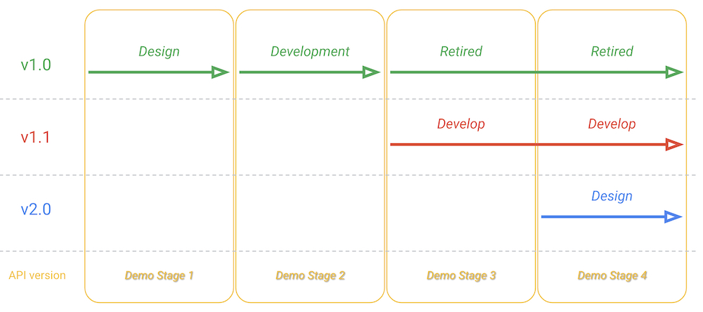
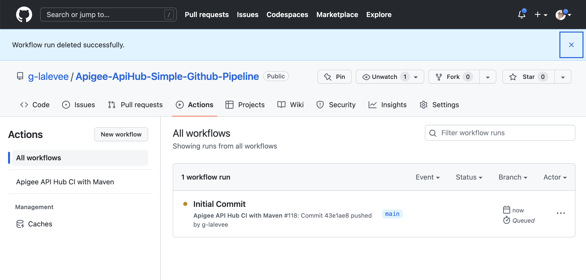
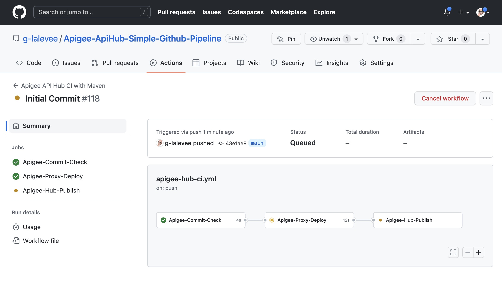
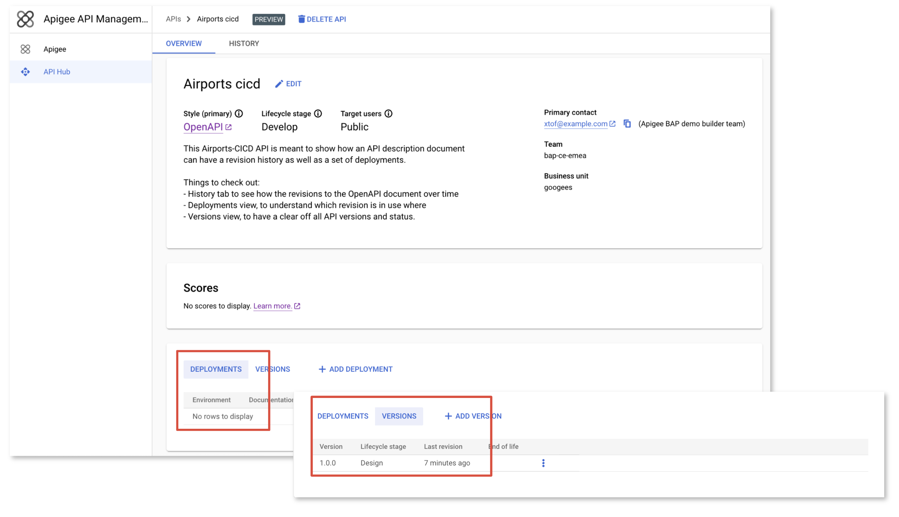
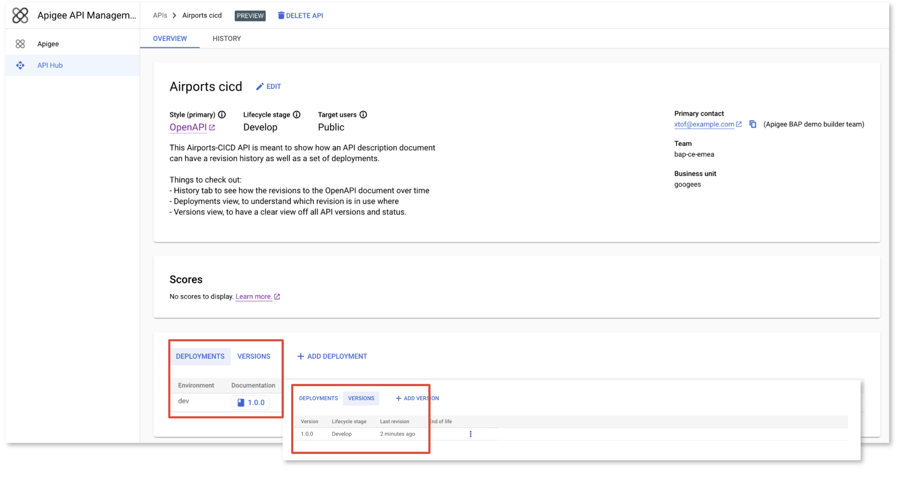
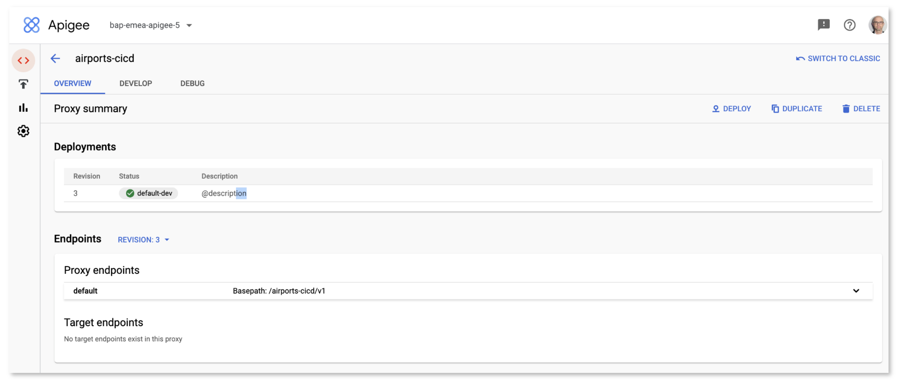

# Apigee-ApiHub-Simple-Github-Pipeline

[](https://shields.io/)
[](https://shields.io/) 


**This is not an official Google product.**<BR>This implementation is not an official Google product, nor is it part of an official Google product. Support is available on a best-effort basis via GitHub.

***

## Goal

Simple implementation of a CI/CD pipeline for Apigee using GitHub repository, 
[CI/CD with GitHub](https://docs.GitHub.com/ee/ci/introduction/) and Apigee Maven Plugins.


### The CICD pipeline includes:

- An Apigee proxy to be deployed in Apigee X/hybrid (Edge/OPSK not supported)
    - Folder **apiProxy**
    - Static Apigee Proxy code analysis using [apigeelint](https://github.com/apigee/apigeelint)
    - Static JS code analysis using [eslint](https://eslint.org/)
    - Unit JS testing using [mocha](https://mochajs.org/)
    - Integration testing of the deployed proxy using [apickli](https://github.com/apickli/apickli)
    - Packaging and deployment of the API proxy bundle using
    [Apigee Deploy Maven Plugin](https://github.com/apigee/apigee-deploy-maven-plugin)

- A corresponding API specification file (OAS, Open Api Specification) and its configuration file to be published on Apigee Api Hub (several versions)
    - Folder **apiHub**
    - Publication of the API into Apigee Api Hub using
    [Apigee Registry Maven Plugin](https://github.com/apigee/apigee-registry-maven-plugin)


### Pipeline Principle


3 jobs:
   - Detect what has changed (proxy or specification)
   - Deploy proxy to Apigee if it has changed
   - Publish the specification on API Hub if it has changed
  

## Limitations & Requirements

-  The authentication to the Apigee X / Apigee hybrid API is done using a GCP Service Account. See CI/CD Configuration [Instructions](https://xxx).
- Apigee Hub must be provisioned. See [Api Hub Documentation](https://cloud.google.com/apigee/docs/api-hub/get-started-api-hub)

***

<BR>

## CI/CD Configuration Instructions

### Initialize a GitHub Repository

Create a GitHub repository to hold your API Proxy. 

To use the `Apigee-ApiHub-Simple-Github-Pipeline`
in your GitHub repository like `github.com/my-user/my-apihub-proxy-repo`, follow these
steps:

```bash
git clone git@github.com:g-lalevee/Apigee-ApiHub-Simple-Github-Pipeline.git
cd Apigee-ApiHub-Simple-Github-Pipeline
git init
git remote add origin git@github.com:my-user/my-apihub-proxy-repo.git
git checkout -b feature/cicd-pipeline
git add .
git commit -m "initial commit"
git push -u origin feature/cicd-pipeline
```

### Google Cloud: Create Service Account

Apigee X deployement requires a GCP Service Account with the following roles (or a custom role with all required permissions):

- Apigee Environment Admin
- Cloud Apigee Registry Editor

To create it in your Apigee organization's GCP project, use following gcloud commands (or GCP Web UI):

```sh
SA_NAME=<your-new-service-account-name>

gcloud iam service-accounts create $SA_NAME --display-name="GitHub-ci Service Account"

PROJECT_ID=$(gcloud config get-value project)
GitHub_SA=$SA_NAME@$PROJECT_ID.iam.gserviceaccount.com

gcloud projects add-iam-policy-binding "$PROJECT_ID" \
  --member="serviceAccount:$GitHub_SA" \
  --role="roles/apigee.environmentAdmin"

gcloud projects add-iam-policy-binding "$PROJECT_ID" \
  --member="serviceAccount:$GitHub_SA" \
  --role="roles/apigee.apiAdmin"

gcloud projects add-iam-policy-binding "$PROJECT_ID" \
  --member="serviceAccount:$GitHub_SA" \
  --role="roles/apigeeregistry.editor"

gcloud iam service-accounts keys create $SA_NAME-key.json --iam-account=$GitHub_SA --key-file-type=json 

```

Copy `<your-new-service-account-name>-key.json` file content to clipboard. 


### GitHub Configuration 

Add GitHub secrets `GCP_SERVICE_ACCOUNT`, to store your Apigee User ID and password:
- Go to your repository’s **Settings** > **Secrets**.
- Click the **New Repository Secret** button.<BR>Fill in the details:
  - Name: GCP_SERVICE_ACCOUNT
  - Value: paste clipboard (containing GCP SA JSON key copied before)
  - Keep this value secret: checked
  - Click the **Add secret** button

***

<BR>

## Run the demo

### Demo scenario

The pipeline illustrates SDLC for both OAS file and corresponding Apigee proxy. 

4 steps: 

  - Stage 1: New specification version 1.0.0 is in `design` stage
  - Stage 2: Specification version 1.0.0 is in `develop` stage and deployed (Apigee proxy is deployed)
  - Stage 3: New specification version 1.0.1 is in `develop` stage, but updated (Apigee proxy is updated). Version 1.0.0 is retired
  - Stage 4: New specification version 2.0.0 is in `design` stage



<BR>

> Note: the **demo_files** folder contains specification files and Api Hub configuration files needed for each stages.

<BR>

### Set pipeline variables

Using your favorite IDE...

- Update the **.github/workflows/apigee-hub.yml** file.<BR>
In **"env"** section (workflow level), change `APIGEE_ORG`, `APIGEE_ENV` and `TEST_HOST` values by your target Apigee organization values.

***

### Stage 1: API version 1.0.0 (Design Status)

1.  Update the **apiHub / specs / airport-1.0.0.yaml** file: set **host** with your Apigee environment hostname.
2. Save
3. Commit, Push

Use the GitHub UI to monitor your pipeline execution:

- Go to your GitHub repository > **Actions** (tab). You can see your workflow running.



<BR>

- Click on it to see execution detail. In list of jobs, click on the job you want to see logs.



<BR>

You should see:
  - Job **Apigee-Commit-Check** checks commited files to trigger the next needed jobs
  - Job **Apigee-Proxy-Deploy** is triggered but all steps are skipped as Apigee proxy was not updated/commited
  - Job **Apigee-Hub-Publish** is triggered to publish API version 1.0.0 in **design** status

<BR>

Open API Hub service console and verify that the API 1.0.0 was published in **design** status, with no Deployment.

  

<BR>

***

### Stage 2: : version 1.0.0 (Develop Status, Deployed)

1.  Replace content of file **apiHub / api-config.yaml** file with content of file **demo_file / apiHub / 2_api-config-dev-1.0.yaml**.
2.  Copy folders  **demo_file / apiProxy / apiproxy** and **demo_file / apiProxy / test** to **apiProxy** folder
3. Commit, Push

<BR>

Use the GitHub UI to monitor your pipeline execution:

You should see:
  - Job **Apigee-Commit-Check** checks commited files to trigger the next needed jobs
  - Job **Apigee-Proxy-Deploy** is triggered and deploys the Apigee proxy
  - Job **Apigee-Hub-Publish** is triggered and publish API version 1.0.0 in develop status

Open API Hub service console and verify that the API 1.0.0 was published in **Develop** status, with one Deployment.

  

Open Apigee console and verify that the **airports-cicd** was deployed in the right environment.

  


<BR>

***

### Stage 3: version 1.0.1 (Develop Status, Deployed), version 1.0.0 (Retired)

1.  Copy the **demo_file / apiHub / specs / airport-1.0.1.yaml** to **apiHub / specs** folder
2.  Update the **apiHub / specs / airport-1.0.1.yaml** file: set **host** with your Apigee environment hostname.
3. Save
4.  Replace content of file **apiHub / api-config.yaml** file with content of file **demo_file / apiHub / 3_api-config-dev-1.1.yaml**.
5. Commit, Push

<BR>

Use the GitHub UI to monitor your pipeline execution:

You should see:
  - Job **Apigee-Commit-Check** checks commited files to trigger the next needed jobs
  - Job **Apigee-Proxy-Deploy** is triggered but all steps are skipped as Apigee proxy was not updated (from Apigee proxy point of view, no difference between API v1.0.0 and API v1.0.1)
  - Job **Apigee-Hub-Publish** is triggered and publish API version 1.0.1 in **Develop** status, and move API 1.0.0 in **Retired** status

Open API Hub service console and verify that the API 1.0.1 was published in **Develop** status, with one Deployment, and API 1.0.0 was **retired**.

 

<BR>

***

### Stage 4: version 1.0.1 (Develop Status, Deployed), version 1.0.0 (Retired), version 2.0.0 (Design Status)

1.  Copy the **demo_file / apiHub / specs / airport-2.0.0.yaml** to **apiHub / specs** folder
2.  Update the **apiHub / specs / airport-2.0.0.yaml** file: set **host** with your Apigee environment hostname.
3. Save
4. Replace content of file **apiHub / api-config.yaml** file with content of file **demo_file / apiHub / 4_api-config-design-2.0.yaml**
5. Commit, Push

<BR>

Use the GitHub UI to monitor your pipeline execution:

You should see:
  - Job **Apigee-Commit-Check** checks commited files to trigger the next needed jobs
  - Job **Apigee-Proxy-Deploy** is triggered but all steps are skipped as Apigee proxy was not updated  
  - Job **Apigee-Hub-Publish** is triggered and publish Api version 2.0.0 in **design** status

 Open API Hub service console and verify that the API 1.0.1 was published in **Develop** status, with one Deployment, and API 1.0.0 was **retired**, and API 2.0.0 was in **Design**.

  

<BR>